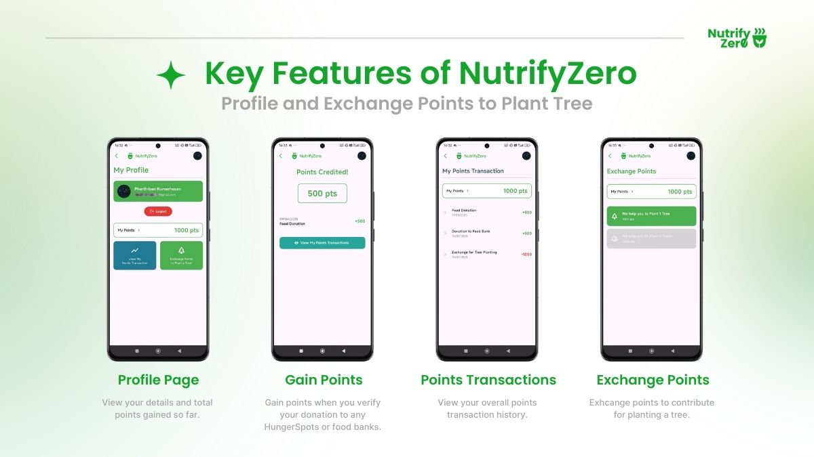

# Nutrify Zero

## Installation Instructions (Android)

You can install Nutrify Zero on your Android device by downloading the `.apk` file directly from our releases.

**1. Download the APK:**

* Go to the latest release page: [Nutrify Zero v1.1.0 Release](https://github.com/kpharthiban/nutrify-zero/releases/tag/v1.1.0)
* Scroll down to the **Assets** section.
* Click on the `nutrify-zero-temp-release.apk` file to download it to your device.

**2. Enable Installation from Unknown Sources:**

* Before you can install the APK, you might need to allow installations from sources other than the Google Play Store.
* When you try to open the downloaded `.apk` file, Android might prompt you to allow installation from your browser or file manager. Grant this permission.
    * *Alternatively, you may need to go to your device's **Settings** > **Security** or **Settings** > **Apps & notifications** > **Special app access** > **Install unknown apps** and enable it for your file manager or browser.* The exact path varies depending on your Android version and manufacturer.

**3. Install the App:**

* Open your device's file manager app and navigate to your `Downloads` folder (or wherever you saved the `.apk` file).
* Tap on the downloaded `nutrify-zero-temp-release.apk` file.
* Follow the on-screen prompts to install the application.

## Running the App

1.  Once the installation is complete, find the **Nutrify Zero** icon in your app drawer or on your home screen.
2.  Tap the icon to launch the app.

## Know about NutrifyZero

---

*If you encounter any issues, please report them via the [Issues tab](https://github.com/kpharthiban/nutrify-zero/issues) on GitHub.*